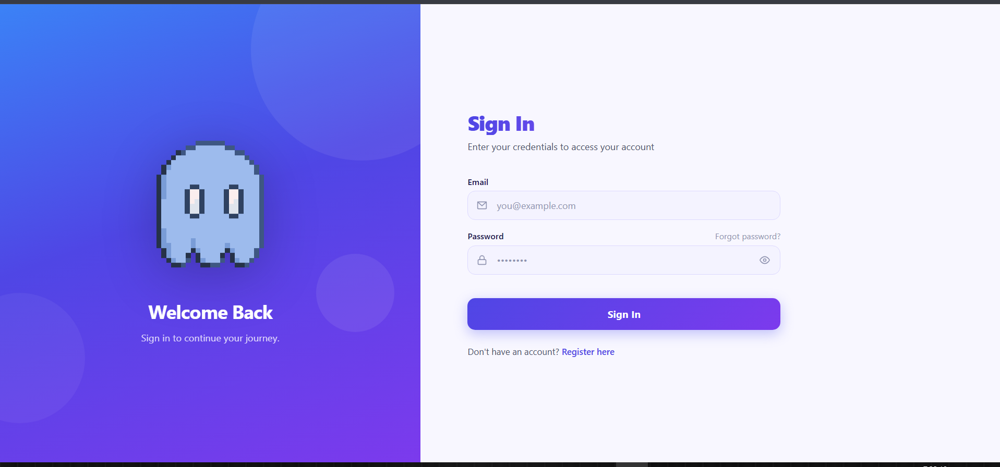
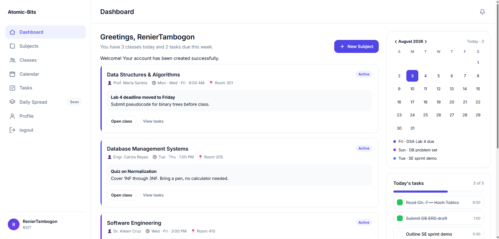
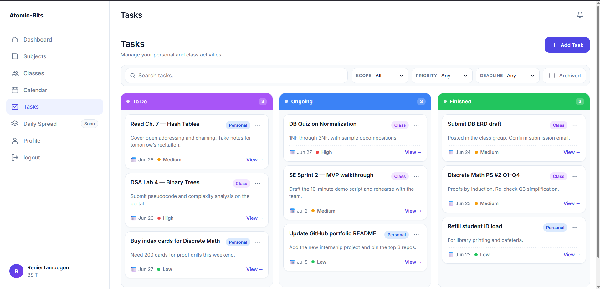
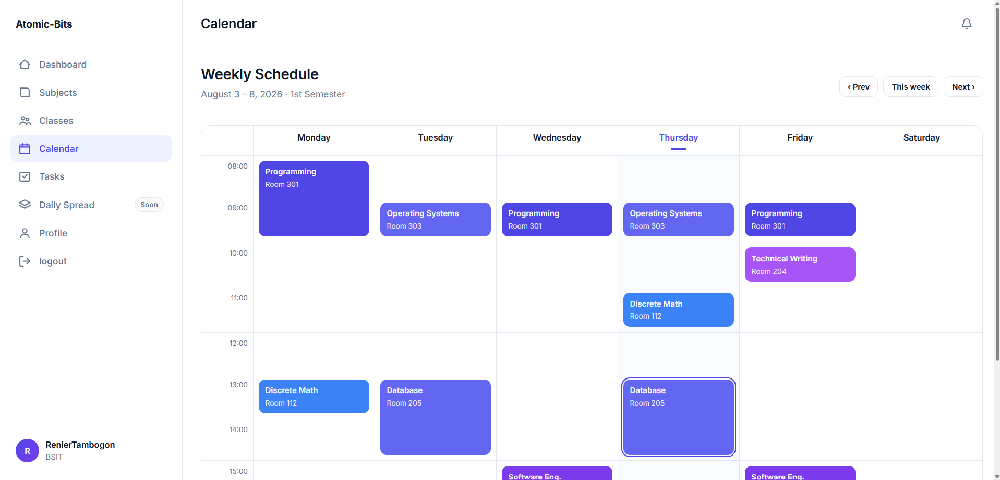

<div align="center">

# Atomic Bits

*A personal productivity and academic collaboration platform built with Laravel.*

Atomic Bits was created to help me organize my academic work while giving my classmates and project group members a place to collaborate on shared tasks, deadlines, and projects.

---


</div>

---

# About

Atomic Bits is a personal productivity platform designed around my daily life as a BS Information Technology student.

I built it because I wanted one application where I could organize assignments, school projects, notes, deadlines, and study tasks. As the project evolved, I expanded it into a collaborative platform where classmates and project group members can work together, assign responsibilities, and keep track of progress.

More than a productivity application, Atomic Bits serves as my learning project where I continuously practice software engineering principles and modern Laravel development.

---

# Tech Stack

<div align="center">


</div>

---

# Features

* User authentication
* Academic task management
* Subject organization
* Class collaboration
* Project workspace
* Deadline tracking
* Responsive design
* Secure authentication
* Modern Laravel architecture

---

# Security

Atomic Bits follows several security practices during development.

* CSRF Protection
* Idempotency Keys
* Rate Limiting
* Password Hashing
* Request Validation
* Secure Session Authentication
* Protected Routes

---

# What I Learned

Developing Atomic Bits helped me gain hands-on experience with:

* Laravel Framework
* MVC Architecture
* PostgreSQL Database Design
* Authentication
* Middleware
* Routing
* Migrations
* Eloquent ORM
* Blade Templates
* Git Version Control
* Secure Web Development
* Responsive UI Design
* Project Architecture
* Code Refactoring

---

# Screenshots

> Screenshots will be added as the project continues to evolve.

| Signin                     | Dashboard                      |
| -------------------------- | ------------------------------ |
| |  |

| Tasks                      | Calendar                       |
| -------------------------- | ------------------------------ |
|   |   |

---

# Installation

```bash
git clone https://github.com/yourusername/atomic-bits.git

cd atomic-bits

composer install

cp .env.example .env

php artisan key:generate

php artisan migrate

php artisan serve
```

Configure your PostgreSQL database inside the `.env` file before running the migrations.

---

# Database Schema

Current core modules include:

```text
Users
│
├── Subjects
│      │
│      └── Tasks
│
├── Classes
│      │
│      ├── Members
│      └── Projects
│
└── Notifications
```

The database is designed using PostgreSQL with relational tables and foreign key constraints to maintain data integrity.

---

# Project Structure

```text
app/
 ├── Http/
 │    ├── Controllers
 │    ├── Middleware
 │    └── Requests
 │
 ├── Models
 ├── Services
 └── Providers

database/
 ├── migrations
 └── seeders

resources/
 ├── views
 ├── css
 └── js

routes/
 ├── web.php
 └── auth.php
```

---

# Roadmap

* [x] User Authentication
* [x] Task Management
* [x] PostgreSQL Integration
* [x] Laravel Migration
* [ ] Group Collaboration
* [ ] Shared Kanban Boards
* [ ] Notifications
* [ ] Calendar Integration
* [ ] File Uploads
* [ ] Real-time Updates
* [ ] Android Application

---

# License


This project is licensed under the Apache License 2.0.

Copyright © 2026 Renier Jhon

You are allowed to use, modify, and distribute this project under the terms of the Apache License 2.0. Any distributed copies or substantial portions of this project must include the original copyright notice and license.

For more information, see the full license:
https://www.apache.org/licenses/LICENSE-2.0


---

# Developer

**Jhon Renier Tambogon**

Bachelor of Science in Information Technology

Atomic Bits is my long-term personal project where I apply new concepts, experiment with ideas, and continue improving my skills in full-stack web development and software engineering.
